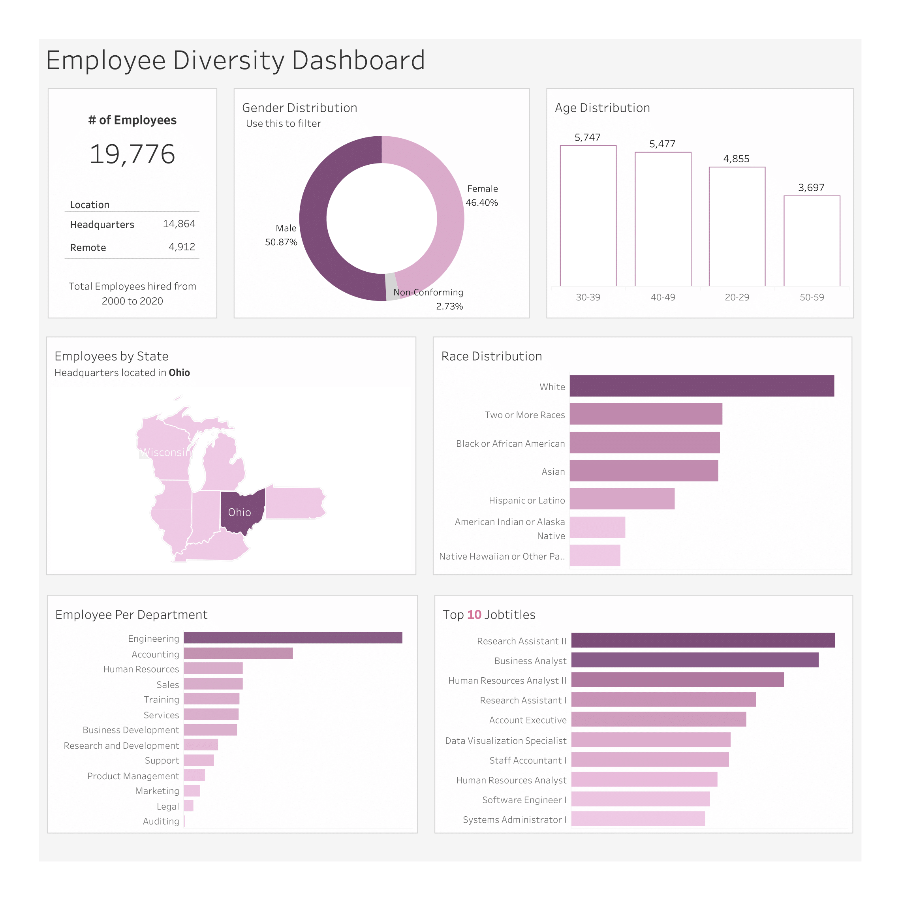
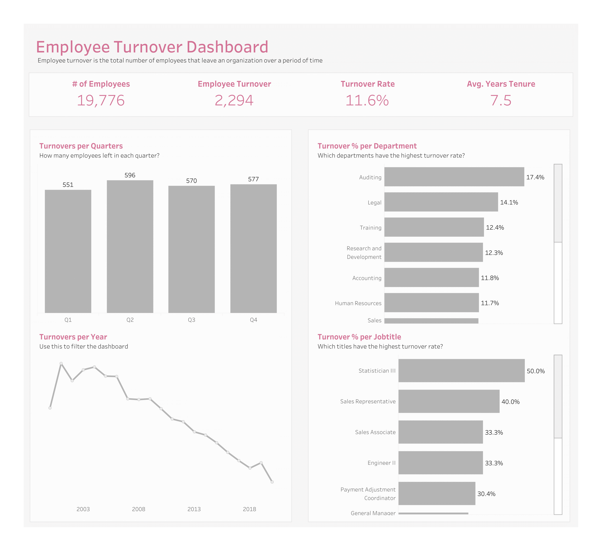

# HR Dashboard

### Background
In this project, I work for a fictitious company that wants to increase diversity and enhance retention in the workplace. 
To achieve this goal, HR executives need to understand their employees’ demographic characteristics and turnover rates over the past years. 

Here are the questions and metrics the HR executives are interested in:
1. What is the gender breakdown and ethnicity breakdown of Employees?
2. What is the age distribution of Employees
3. How many employees work at headquarters versus remote locations?
4. What is the average length of employment for employees who have been terminated?
5. How does the gender distribution vary across departments?
6. What is the distribution of job titles across the company?
7. Which department has the highest turnover rate?
8. What is the turnover rate across job titles?
9. How have turnover rates changed each year?
10. What is the distribution of employees across States?

Understanding the above metrics helps executives make data-driven decisions. The dataset has been cleaned using SQL.
The purpose of this post is to show insights and recommendations based on my visualization.

### Insights
I grouped my findings under Employee diversity and turnover rate and I developed two [dashboards](https://public.tableau.com/app/profile/eyitayo.ogunniyi/viz/HRDashboard_16935056989710/HRDashboard) to communicate my findings.

**Employee Diversity**

The total number of Employees hired from 2000 to 2020 is 19,776, out of which 14,864 work from the headquarters. This means that **25%** of employees work remotely.

50.87% of people hired are Male, 46.40% female, and **2.73%** non-conforming. The company has more employees between the ages of 30 to 49.

16,031 employees (**81%** of the total) live in Ohio while Wisconsin has the least employees. This correlates with the above insight since the headquarters is located in Ohio. 5,635 of the employees hired are White and this is the race with the highest employees.

The Engineering department has the most employees. The company hired more Research Assistant II followed by Business Analyst and Human Resources Analyst II

**Turnover Rate**

The number of Employees that have left the company between 2020 and now is 2,294. The turnover rate is 11.6%, which means that 11.6% of all employees hired have left the company.

The year 2001 had the highest turnover rate with 18.2% while 2020 had the lowest turnover rate with 2.5% of employees hired leaving the company.

The department and position with the highest turnover rate are Auditing and Statistician III respectively. 17.4% of the employees hired in the Auditing department and 50% of the Statistician III left the department

### Recommendations
Here are a few recommendations that will help the company to increase employee diversity and reduce the turnover rates

1. Gender inclusiveness should be embraced especially for the non-conforming. Also, hire more people from the age of 20 to 29.
2. Create an enabling environment for employees to work remotely, hence employing more people living outside of Ohio. Ask questions like can fewer employees work from the headquarters? Employees can also be allowed to work hybrid.
3. The turnover rate has reduced over the years and this is impressive but there are positions with over 20% turnover rate. The company can have discussions with employees in those positions, conduct surveys to understand the factors influencing turnovers, and take action.
